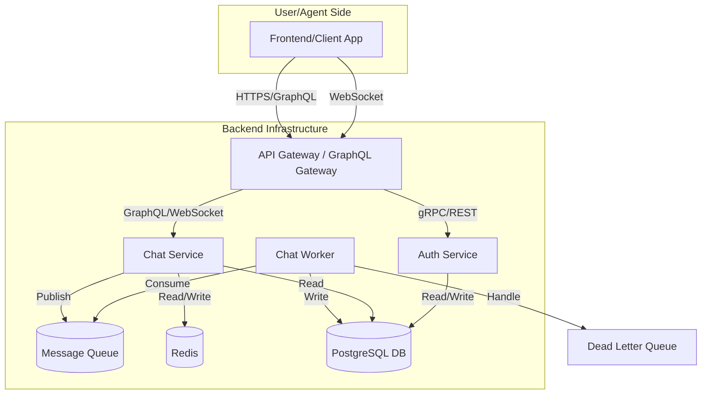

# High-Level Architecture

Dokumen ini menjelaskan arsitektur tingkat tinggi untuk sistem Healthcare CRM dengan fitur obrolan real-time.

## 1. Diagram Arsitektur

Berikut adalah diagram yang menggambarkan komponen utama dan alirannya:



### Komponen:

-   **Frontend**: Aplikasi web (React) yang digunakan oleh pengguna dan agen customer support.
-   **API Gateway**: Titik masuk tunggal untuk semua permintaan dari frontend. Menggunakan GraphQL Federation untuk menggabungkan skema dari layanan-layanan di bawahnya dan meneruskan permintaan ke layanan yang sesuai. Juga menangani koneksi WebSocket.
-   **Auth Service**: Bertanggung jawab untuk otentikasi (register, login) dan otorisasi (validasi token JWT).
-   **Chat Service**: Mengelola logika bisnis terkait obrolan, seperti mengirim pesan, menerima pesan, dan mengelola status real-time (misalnya, status online pengguna). Terhubung dengan Redis untuk sesi dan status, serta dengan Message Queue untuk pengiriman pesan asinkron.
-   **Message Queue (e.g., RabbitMQ/Kafka)**: Digunakan untuk menangani pengiriman pesan secara asinkron. Ini membantu sistem tetap responsif di bawah beban tinggi dan memastikan pengiriman pesan yang andal.
-   **Chat Worker**: Sebuah proses terpisah yang mengambil (consume) pesan dari antrian (queue) dan menyimpannya secara permanen ke database PostgreSQL. Ini memisahkan proses penulisan dari alur permintaan utama.
-   **PostgreSQL Database**: Database relasional utama untuk menyimpan data secara persisten, seperti informasi pengguna, riwayat obrolan, dll.
-   **Redis**: Digunakan untuk caching, mengelola status koneksi WebSocket, dan data sementara lainnya yang memerlukan akses cepat untuk menjaga performa sistem.
-   **Dead Letter Queue (DLQ)**: Antrian khusus untuk menampung pesan yang gagal diproses oleh worker setelah beberapa kali percobaan.

## 2. Penjelasan Alur dan Pilihan Desain

### Kapan Menggunakan Sync (GraphQL) vs. Async (Message Queue)?

-   **Synchronous (GraphQL)**: Digunakan untuk operasi yang membutuhkan respons langsung dan cepat. Contohnya:
    -   **Login/Register**: Pengguna harus segera tahu apakah login berhasil atau gagal.
    -   **Mengambil Riwayat Obrolan**: Saat pengguna membuka ruang obrolan, mereka perlu melihat pesan-pesan sebelumnya dengan cepat.
    -   **Mengambil Daftar Kontak/Obrolan**: Pengguna memerlukan daftar obrolan mereka secara real-time.
    -   **Validasi Token**: Service lain perlu validasi cepat dari Auth Service.

-   **Asynchronous (Message Queue)**: Digunakan untuk operasi yang dapat diproses di latar belakang tanpa membuat pengguna menunggu, atau untuk tugas-tugas yang berat dan memerlukan keandalan tinggi. Contohnya:
    -   **Mengirim Pesan Obrolan**: Saat pengguna mengirim pesan, pesan tersebut dapat segera ditampilkan di UI-nya seolah-olah sudah terkirim. Di latar belakang, pesan dimasukkan ke dalam antrian untuk diproses dan disimpan ke database. Ini memberikan pengalaman pengguna yang sangat responsif, terutama saat lalu lintas tinggi.
    -   **Mengirim Notifikasi**: Proses pengiriman notifikasi push atau email bisa memakan waktu dan dapat gagal. Menempatkannya di antrian memastikan proses ini tidak memblokir alur utama.
    -   **Memproses Lampiran (Attachment)**: Mengunggah dan memproses file besar adalah operasi yang lambat. Ini harus dilakukan secara asinkron.

### Alur Mengirim Pesan dari Pengguna ke Agen

1.  **Pengguna (User)** mengetik pesan di **Frontend** dan menekan tombol kirim.
2.  **Frontend** mengirimkan pesan melalui koneksi **WebSocket** ke **API Gateway**.
3.  **API Gateway** meneruskan pesan ke **Chat Service**.
4.  **Chat Service** melakukan beberapa hal secara paralel:
    a. Mem-publish pesan ke **Message Queue** untuk pemrosesan asinkron (penyimpanan ke database).
    b. Menyimpan informasi sementara atau status pesan di **Redis** jika diperlukan (misalnya, untuk tanda 'terkirim').
    c. Mencari tahu agen mana yang sedang online dan terhubung ke ruang obrolan yang sama (informasi ini bisa didapat dari Redis).
    d. Mendorong (push) pesan secara real-time melalui **WebSocket** (via Gateway) ke **Frontend** agen yang relevan.
5.  **Chat Worker** mengambil pesan dari **Message Queue**.
6.  **Worker** menyimpan pesan tersebut ke dalam database **PostgreSQL**.
7.  Jika penyimpanan gagal setelah beberapa kali percobaan, pesan akan dipindahkan ke **Dead Letter Queue (DLQ)** untuk dianalisis lebih lanjut oleh tim developer/ops.

## 3. Penyimpanan Pesan: Langsung ke DB vs. Melalui Antrian

**Pilihan: Pesan disimpan melalui Message Queue terlebih dahulu.**

**Alasan (Kenapa?):**

1.  **Skalabilitas & Performa**: Dengan 1.000–5.000 pengguna konkuren dan lalu lintas yang *bursty* (tiba-tiba melonjak), menulis langsung ke database dapat menjadi *bottleneck*. Database bisa kelebihan beban, menyebabkan latensi tinggi. Dengan menggunakan antrian, kita memisahkan (decouple) proses penerimaan pesan dari proses penulisan ke database. Chat Service bisa menerima ribuan pesan per detik dan memasukkannya ke antrian dengan sangat cepat, sementara worker dapat menulis ke database sesuai dengan kapasitasnya.
2.  **Keandalan (Reliability)**: Jika database sedang down atau mengalami latensi tinggi, pesan tidak akan hilang. Pesan akan tetap aman di dalam Message Queue dan akan diproses oleh worker setelah database kembali normal. Ini sangat penting untuk riwayat obrolan yang harus andal.
3.  **Pengalaman Pengguna (User Experience)**: Pengguna mendapatkan respons instan bahwa pesan mereka "terkirim" karena Chat Service hanya perlu memasukkan pesan ke antrian, yang merupakan operasi yang sangat cepat. Pengguna tidak perlu menunggu konfirmasi dari database.

## 4. Penanganan Masalah Umum

### Menjaga Urutan Pesan (Message Ordering)

-   **Strategi**: Menggunakan **antrian FIFO (First-In-First-Out) per ruang obrolan (chat room)**. Setiap ruang obrolan akan memiliki antrian khususnya sendiri atau partisinya sendiri dalam sebuah topic (jika menggunakan Kafka). Ini memastikan bahwa semua pesan dalam satu obrolan akan diproses sesuai urutan pengirimannya.
-   **Timestamp**: Setiap pesan juga harus diberi timestamp yang akurat di sisi klien atau saat pertama kali diterima oleh server. Timestamp ini digunakan sebagai fallback atau untuk pengurutan di sisi klien jika diperlukan.

### Mencegah Pesan Duplikat (Duplicate Message)

-   **Kunci Idempotensi**: Setiap pesan yang dikirim dari klien harus memiliki **ID unik (misalnya, UUID)** yang dibuat di sisi klien. Saat worker memproses pesan, ia akan memeriksa apakah ID pesan tersebut sudah pernah diproses (misalnya, dengan memeriksa di Redis atau di tabel database). Jika ID sudah ada, pesan tersebut diabaikan. Ini membuat operasi penyimpanan menjadi idempoten.

### Menangani Percobaan Ulang & Kegagalan (Retry & Failure)

-   **Mekanisme Retry**: Jika worker gagal menyimpan pesan ke database (misalnya, karena database sementara tidak tersedia), Message Queue dapat dikonfigurasi untuk mencoba mengirim ulang pesan tersebut secara otomatis. Biasanya menggunakan strategi *exponential backoff* (menambah jeda waktu antar percobaan) untuk tidak membebani sistem yang sedang bermasalah.
-   **Dead Letter Queue (DLQ)**: Setelah beberapa kali percobaan gagal (misalnya, 3 kali), pesan akan secara otomatis dipindahkan ke **Dead Letter Queue (DLQ)**. Ini mencegah pesan yang rusak atau bermasalah memblokir antrian utama. Tim operasional atau developer dapat memantau DLQ untuk mendiagnosis masalah, memperbaiki data secara manual, atau memproses ulang pesan tersebut.

## Diagram

```
+----------+      +-----------------+      +-----------------+
|          |----->|                 |----->|                 |
| Frontend |      | Gateway (GraphQL) |      |   Auth Service  |
|          |<-----|                 |<-----|                 |
+----------+      +-----------------+      +-----------------+
      ^                    |
      |                    |
      v                    v
+----------+      +-----------------+      +-----------------+
|          |----->|                 |----->|                 |
|  User    |      |  Chat Service   |      |  Message Queue  |
|          |<-----|                 |<-----|   (RabbitMQ)    |
+----------+      +-----------------+      +-----------------+
      ^                    |
      |                    |
      v                    v
+----------+      +-----------------+
|          |----->|                 |
|  Agent   |      |   Database      |
|          |<-----|  (PostgreSQL)   |
+----------+      +-----------------+
                         |
                         |
                         v
                    +-------+
                    | Redis |
                    +-------+
```

## Penjelasan

### Kapan pakai sync (GraphQL) vs async (message queue)

*   **Sinkron (GraphQL):** Digunakan untuk operasi yang membutuhkan respons langsung, seperti:
    *   Mengambil daftar chat.
    *   Mengambil riwayat pesan dalam sebuah chat room.
    *   Memvalidasi token otentikasi.
*   **Asinkron (Message Queue):** Digunakan untuk operasi yang tidak membutuhkan respons langsung dan dapat diproses di latar belakang, seperti:
    *   Mengirim pesan.
    *   Memperbarui status pesan (misalnya, "terkirim", "dibaca").

### Alur kirim pesan dari user → agent

1.  User mengirim pesan melalui frontend.
2.  Frontend mengirimkan mutasi GraphQL `sendMessage` ke Gateway.
3.  Gateway meneruskan permintaan ke Chat Service.
4.  Chat Service mem-publish pesan ke Message Queue.
5.  Seorang worker (bagian dari Chat Service) meng-consume pesan dari Message Queue.
6.  Worker menyimpan pesan ke Database.
7.  Worker mem-publish pesan ke channel Redis yang sesuai dengan chat room.
8.  Frontend agent yang terhubung ke channel Redis tersebut akan menerima pesan baru secara real-time.

### Pilih: Apakah chat message disimpan langsung ke PostgreSQL atau lewat queue dulu? Kenapa?

Pesan chat harus disimpan **lewat queue dulu**.

**Alasan:**

*   **Ketahanan:** Seperti yang dijelaskan sebelumnya, ini mencegah kehilangan pesan jika database tidak tersedia.
*   **Performa:** Mengurangi latensi yang dirasakan oleh pengguna saat mengirim pesan.
*   **Skalabilitas:** Memungkinkan pemrosesan pesan yang berat (misalnya, memproses lampiran) untuk dilakukan secara asinkron tanpa memblokir alur utama.

### Bagaimana cara kamu:

*   **Menjaga ordering message:**
    *   Setiap pesan diberi **timestamp** saat diterima oleh Chat Service. Pesan diurutkan berdasarkan timestamp ini di sisi klien.
*   **Mencegah duplicate message:**
    *   Setiap pesan diberi **ID unik** oleh klien. Chat Service melacak ID pesan yang telah diproses untuk mencegah pemrosesan duplikat.
*   **Handle retry & failure:**
    *   **Retry:** Jika worker gagal memproses pesan, pesan akan dikirim kembali ke antrian untuk dicoba lagi.
    *   **Failure:** Setelah beberapa kali percobaan gagal, pesan akan dipindahkan ke **Dead Letter Queue (DLQ)** untuk dianalisis secara manual.